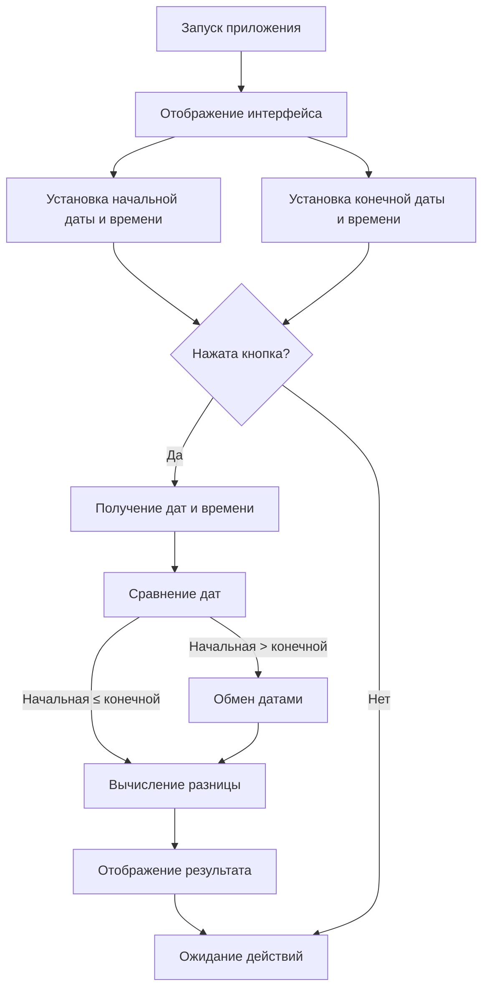

# README: Калькулятор времени

## Описание
Калькулятор времени — это приложение с графическим интерфейсом, написанное на Python с использованием библиотеки PyQt6. Оно позволяет вычислять разницу между двумя датами и временем, отображая результат в годах, месяцах, днях, часах, минутах и секундах.

---

## Функциональные возможности
1. **Установка начальной и конечной даты и времени**:
   - Возможность выбора даты через календарь.
   - Установка времени вручную или автоматически (кнопка "Сейчас").
2. **Расчет разницы**:
   - Автоматическое определение разницы между датами.
   - Корректная обработка случаев, когда начальная дата позже конечной.
3. **Отображение результата**:
   - Результат выводится в таблице с разбивкой по годам, месяцам, дням, часам, минутам и секундам.

---

## Требования
Для работы скрипта необходимо установить следующие библиотеки:
- Python 3.8 или выше
- PyQt6
- python-dateutil

Установка зависимостей:
```bash
pip install PyQt6 python-dateutil
```

---

## Инструкция по использованию
1. Запустите скрипт:
   ```bash
   python date_calculator.py
   ```
2. Установите начальную дату и время:
   - Используйте календарь для выбора даты.
   - Введите время вручную или нажмите "Сейчас" для автоматической установки текущего времени.
3. Установите конечную дату и время аналогичным образом.
4. Нажмите кнопку "Рассчитать разницу".
5. Результат отобразится в таблице ниже.

---

## Блок-схема работы скрипта


---

## Пример использования
1. Установите начальную дату: 01.01.2023, время: 10:00.
2. Установите конечную дату: 01.01.2024, время: 12:30.
3. Нажмите "Рассчитать разницу".
4. Результат:
   - Годы: 1
   - Месяцы: 0
   - Дни: 0
   - Часы: 2
   - Минуты: 30
   - Секунды: 0

---

## Возможные ошибки
1. **Некорректный ввод времени**:
   - Убедитесь, что время введено в формате `HH:mm`.
2. **Ошибка расчета**:
   - Проверьте, что даты и время установлены корректно. При необходимости нажмите "Сейчас" для автоматической установки.